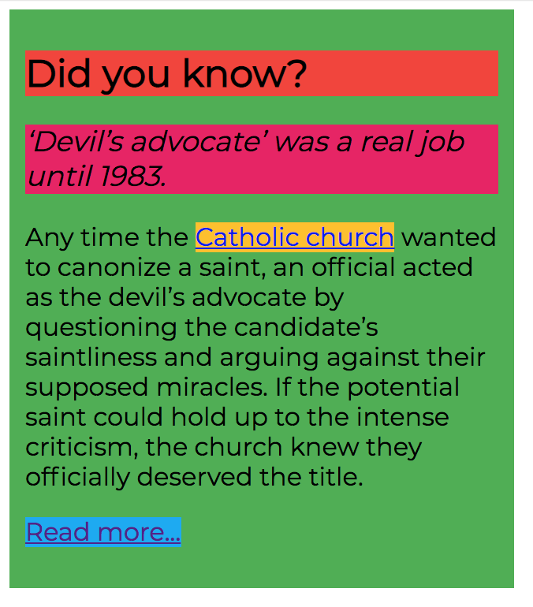
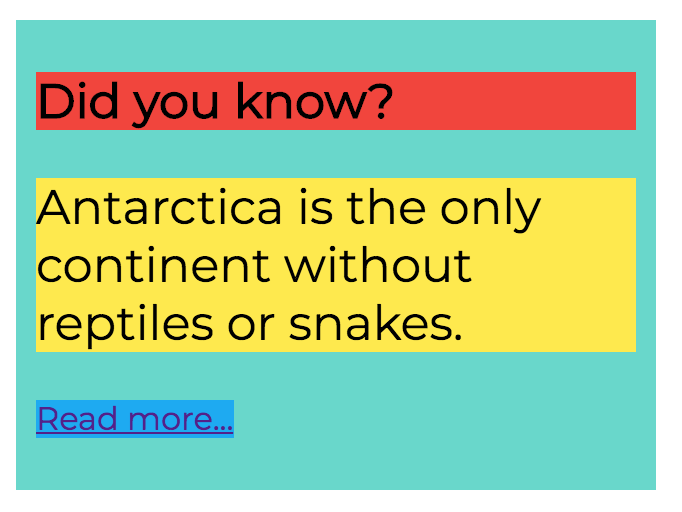

# CSS Basics

## Preparing for this class

## Tools for today

## New concepts for today

- some css properties to start with: font & color
- selectors: tag, class, id; child
- specificity & cascade
- CSS methodologies

## Today's exercises

### 1. what we already know: font styles & colors

Duplicate last class, and add some new styles! work in the CSS file you got last class.   
If you don't have the code at hand, ask one of your classmates!

Follow the designs in Zeplin to redesign last class's exercises: https://app.zeplin.io/project/5b980960f8d0cb9de317da5f screens 1.1-1.3

focus on the following CSS properties: `font-size, color, text-align, font-weight, line-height, text-decoration, text-transform`

### 2. selectors: picking the right class

Given the following CSS code, build the HTML and add the necessary classes to follow the design! Don't touch the CSS!

```css
@import url('https://fonts.googleapis.com/css?family=Montserrat');

.tidbit {
   width: 300px;
   font-family: Montserrat, sans-serif;
   font-size: 16px;
   padding: 10px;
   background: #4caf50;
   margin-bottom: 20px;
}

.nature {
   background: #64d8cb;
}

.title {
   font-weight: bold;
   font-size: 24px;
   background: #f44336;
}

.lead {
   font-size: 18px;
   font-style: italic;
   background: #e91e63;
}

.link {
   background: #ffc107;
}

.more {
   background: #03a9f4;
}

.lead-alt,
.short p {
   font-size: 24px;
   background: #ffeb3b;
}
```

| Content       | Design        |
| ------------- | ------------- |
| ```Did you know? ‘Devil’s advocate’ was a real job until 1983. Any time the Catholic church wanted to canonize a saint, an official acted as the devil’s advocate by questioning the candidate’s saintliness and arguing against their supposed miracles. If the potential saint could hold up to the intense criticism, the church knew they officially deserved the title. Read more...```      | ```***********************************```  |
| ```Did you know? Antarctica is the only continent without reptiles or snakes. Read more...```      | ```***********************************```  |

### 3. the right selectors make redesign easy

Given the code you wrote in the previous exercise, change the CSS so that it follows the new design! Don't touch the HTML! The design to use is  https://app.zeplin.io/project/5b980960f8d0cb9de317da5f screens 3.1-3.2

### 4. modifier classes, context classes

Given the code you wrote in the previous exercise, create a dark version for your design!  https://app.zeplin.io/project/5b980960f8d0cb9de317da5f screen 4

## Project work

Let's continue with the class project!
- Investigate the received design, add some descriptive class names to your sectioned plan.   
- Start a repository for your project work.
- Start with an `index.html` file.
- Remember to commit often, add descriptive commit messages explaining `why` you did what you did!
- Identify main content areas in the design, copy over content to your HTML document.
- Add a reset or normalize stylesheet as a foundation for your styles.
- Start sectioning your content with the proper HTML elements.
- Start adding descriptive classes to your elements.
- Start styling with basic text styles: font family, font sizes and colors. Make sure you reuse your styles and **avoid duplication**.
- Refine your document structure, continue adding contents and elements until ready.
- Push your work to your corresponding remote repository on GitHub.

plan class names, add text styles, **avoid duplication**

## Optional homework

- read more on CSS Specificity on CSS-Tricks https://css-tricks.com/specifics-on-css-specificity/ and on Smashing Magazine https://www.smashingmagazine.com/2007/07/css-specificity-things-you-should-know/ or use the dark side of the force https://stuffandnonsense.co.uk/archives/css_specificity_wars.html
