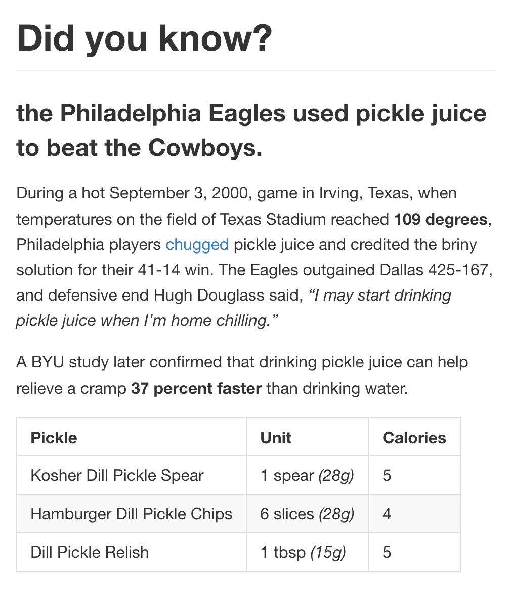

# Dynamic content

## Tools for today

- [Wordpress](https://developer.wordpress.org/themes/)
- [Jekyll](https://help.github.com/articles/using-jekyll-as-a-static-site-generator-with-github-pages/)

## New concepts for today

- Dynamic Content
- Templates
- Template tags
- Admin site

## Today's exercise

### Markdown

- atom markdown preview package
- [markdown cheat sheet](https://github.com/adam-p/markdown-here/wiki/Markdown-Cheatsheet)

| This text | Should look like this |
| -- | -- |
| `Did you know? the Philadelphia Eagles used pickle juice to beat the Cowboys. During a hot September 3, 2000, game in Irving, Texas, when temperatures on the field of Texas Stadium reached 109 degrees, Philadelphia players chugged pickle juice and credited the briny solution for their 41-14 win. The Eagles outgained Dallas 425-167, and defensive end Hugh Douglass said, “I may start drinking pickle juice when I’m home chilling.” A BYU study later confirmed that drinking pickle juice can help relieve a cramp 37 percent faster than drinking water. Pickle Unit alories Kosher Dill Pickle Spear 1 spear (28g) 5 Hamburger Dill Pickle Chips 6 slices (28g) 4 Dill Pickle Relish 1 tbsp (15g) 5`  | `..............................`  |

- add a README to your project repository! try editing it locally!

<!--
# Did you know?

### the Philadelphia Eagles used pickle juice to beat the Cowboys.
During a hot September 3, 2000, game in Irving, Texas, when temperatures on the field of Texas Stadium reached **109 degrees**, Philadelphia players [chugged](http://www.history.com/news/hungry-history/pickles-throughout-history-2) pickle juice and credited the briny solution for their 41-14 win. The Eagles outgained Dallas 425-167, and defensive end Hugh Douglass said, *“I may start drinking pickle juice when I’m home chilling.”*

A BYU study later confirmed that drinking pickle juice can help relieve a cramp **37 percent faster** than drinking water.

| Pickle | Unit | Calories |
| ------ | ---- | -------- |
| Kosher Dill Pickle Spear | 1 spear *(28g)* | 5 |
| Hamburger Dill Pickle Chips | 6 slices *(28g)* | 4 |
| Dill Pickle Relish | 1 tbsp *(15g)* | 5 |
 -->

### A Jekyll blog

- Create a new repository!
- [Choose a theme for your project!](https://help.github.com/articles/adding-a-jekyll-theme-to-your-github-pages-site-with-the-jekyll-theme-chooser/)
- Add a `README.md` to your project with any content!
- [Add a `pickle-day.md` page to your project with the markdown from the previous exercise!](https://jekyllrb.com/docs/pages/)
- Add a link to `pickle-day` to your `README.md`
- [Update your theme:](https://help.github.com/articles/customizing-css-and-html-in-your-jekyll-theme/)
  - change a background color
  - change the text in the footer
  - duplicate layout: create a layout without header and footer + [a page using it](https://jekyllrb.com/docs/front-matter/) with your markdown from above
  - create 2 [blog posts](https://jekyllrb.com/docs/posts/) in a `_posts` directory. add links to them to your default layout.

### Wordpress customization

- Let's go through your wordpress theme code!

## Optional homework
