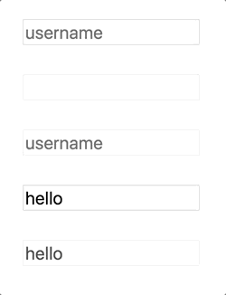

# Forms

## New concepts for today

- form elements
  - input, types
  - textarea
  - select
  - checkbox, radio
  - button
  - label
  - (color, date, range)

## Today's exercises

### Forms: text input elements

| . How &nbsp;&nbsp;&nbsp;&nbsp;&nbsp;&nbsp;&nbsp;&nbsp;&nbsp;&nbsp;. | . What &nbsp;&nbsp;&nbsp;&nbsp;&nbsp;&nbsp;&nbsp;&nbsp;&nbsp;&nbsp;. |
| - | - |
| elements to use: `<input>` with the right `type` attribute, `<textarea>` |  |

### Forms: attributes

| ..How................................. | ..What................................. |
| - | - |
| attributes to use: `disabled`, `placeholder`, `value` |  |

### Forms: checkbox, radio

| How | What |
| - | - |
| elements to use: `<input>`, with types `checkbox` and `radio`, and with correct `name` attributes |   |

### Forms: buttons, labels

| How | What |
| - | - |
| new elements to use: `<button>`, `<label>` with `for` attribute |   |

### Styling input elements: box model

| How | What |
| - | - |
| style your inputs! use `padding`, `margin`, `border` and `background`. [zeplin design here](https://app.zeplin.io/project/5b980960f8d0cb9de317da5f/screen/5bc5fbecd010065fdf8001a2) |   |

### Styling input elements: flexbox

|   |   |
| - | - |
| position your form elements with flexbox! [zeplin design here](https://app.zeplin.io/project/5b980960f8d0cb9de317da5f/screen/5bc6015613f4bb09f4ac9b4d) |   |

## Project work

- apply text styles, create classes for them
- start laying out sections - give them width and height
- lay out the navigation using flexbox
- create the "Our Work" boxes using basic box model
- create the "Meet your new team" boxes using grid
- create the "We wrote a book" section using grid

## Optional homework
- read more on form elements at https://developer.mozilla.org/en-US/docs/Learn/HTML/Forms/The_native_form_widgets
- go through flexbox examples at https://developer.mozilla.org/en-US/docs/Web/CSS/CSS_Flexible_Box_Layout/Typical_Use_Cases_of_Flexbox#Form_controls
- read more of the elements we missed: tables at https://developer.mozilla.org/en-US/docs/Learn/HTML/Tables and multimedia elements at https://developer.mozilla.org/en-US/docs/Learn/HTML/Multimedia_and_embedding
