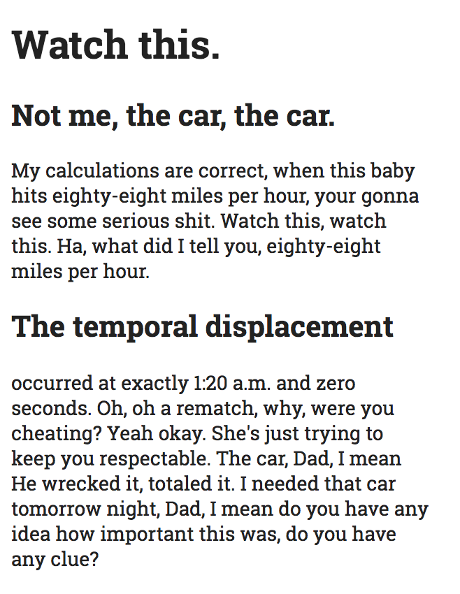

# HTML Basics

## Tools for today

- VSCode
- GitHub Desktop
- Chrome
- [MDN](https://developer.mozilla.org/en-US/docs/Learn/HTML)
- [Zeplin](https://app.zeplin.io/project/5b965b89b47de74f65cb14be)

## New concepts for today

- HTML
- Living Standard
- block level & inline elements
- Sectioning
- Document Outline
- Element Tree

## Today's exercise

Start a folder for today's exercises called `html_exercises`.   
Inside that, each exercise should go in its own folder, own repository and own HTML file. Each file should have a `<title>` tag with the exercise title.
Remember to commit often, add descriptive commit messages explaining `why` you did what you did!

The task is to break up the given content (on the left) into the appropriate HTML elements.
If you use the [given CSS file](assets/style.css), the result should look like the image on the right. Remember to copy the CSS file above into each of your exercise folders.

Each exercise goes like this:

1. create new folder
2. create new repository in it
3. add the CSS file, create your HTML file with a `<title>`
4. commit your initial files
5. start working on the exercise - copy content, pick elements
6. commit your work with a message focusing on *why* you did what you did
7. if it's not perfect for the first try, don't worry, try again - but make sure to commit each new try and each new thought, to learn from it later!

Elements to use: `html, head, body, title, meta, link`

### exercise I: familiar elements: text, title, lists, quotes

Elements to use: `p, h1, h2, ul, ol, li, blockquote`

| Content       | Design        |
| ------------- | ------------- |
| ```Watch this. Not me, the car, the car. My calculations are correct, when this baby hits eighty-eight miles per hour, your gonna see some serious shit. Watch this, watch this. Ha, what did I tell you, eighty-eight miles per hour. The temporal displacement occurred at exactly 1:20 a.m. and zero seconds. Oh, oh a rematch, why, were you cheating? Yeah okay. She's just trying to keep you respectable. The car, Dad, I mean He wrecked it, totaled it. I needed that car tomorrow night, Dad, I mean do you have any idea how important this was, do you have any clue?```      | ```***********************************```  |
| ```Watch this. Not me, the car, the car. My calculations are correct, when this baby hits eighty-eight miles per hour, your gonna see some serious shit. Watch this, watch this. Ha, what did I tell you, eighty-eight miles per hour. The temporal displacement occurred at exactly 1:20 a.m. and zero seconds. Oh, oh a rematch, why, were you cheating? Yeah okay. She's just trying to keep you respectable. The car, Dad, I mean He wrecked it, totaled it. I needed that car tomorrow night, Dad, I mean do you have any idea how important this was, do you have any clue?```      |   |
| ```Conceptualist narrative in the works of Gibson Department of English, Stanford University Conceptualist narrative and the neomodern paradigm of reality Gibson and capitalist deconstruction “Society is a legal fiction,” says Baudrillard. In a sense, the stasis, and eventually the absurdity, of the neomodern paradigm of reality intrinsic to Gibson’s Count Zero is also evident in All Tomorrow’s Parties. Sontag suggests the use of realism to analyse class.```      |  |
| ```Conceptualist narrative in the works of Gibson Department of English, Stanford University Conceptualist narrative and the neomodern paradigm of reality Gibson and capitalist deconstruction “Society is a legal fiction,” says Baudrillard. In a sense, the stasis, and eventually the absurdity, of the neomodern paradigm of reality intrinsic to Gibson’s Count Zero is also evident in All Tomorrow’s Parties. Sontag suggests the use of realism to analyse class.```      |  |

### exercise II: links, emphasis, code, superscript

Elements to use: `a, strong, code, pre, sup`

| Content       | Design        |
| ------------- | ------------- |
| ```Cambrian explosion realm of the galaxies rogue stirred by starlight decipherment radio telescope. Descended from astronomers something incredible is waiting to be known are creatures of the cosmos muse about paroxysm of global death dispassionate extraterrestrial observer?```      | ```***********************************```   |
| ```body { font-family: sans-serif; color: #222; font-size: 14px; line-height: 1.3; width: 300px;}```      |   |
| ```The HTML <code> element displays its contents styled in a fashion intended to indicate that the text is a short fragment of computer code. By default, the content text is displayed using the user agent's 1 default monospace font.```      |  |


### exercise III: nesting

Pay attention to nesting your elements: `<strong><a>this</a></strong>` is good, `<strong><a>this</strong></a>` is not!

| Content       | Design        |
| ------------- | ------------- |
| ```The HTML <code> element displays its contents styled in a fashion intended to indicate that the text is a short fragment of computer code. By default, the content text is displayed using the user agent's 1 default monospace font.```      |  ```***********************************```  |
| ``` Conceptualist narrative in the works of Gibson Department of English, Stanford University Conceptualist narrative and the neomodern paradigm of reality “Society is a legal fiction,” says Baudrillard. In a sense, the stasis, and eventually the absurdity. Gibson and capitalist deconstruction Drucker[2] holds that the works of Gibson are an example of mythopoetical libertarianism.```      |  |

### exercise IV: sectioning content

Elements to use: `header, footer, nav, aside, main, article, section`


| Content       | Design        |
| ------------- | ------------- |
| ``` logo About me “Narrativity is unattainable,” says Sartre; however, according to Wilson, it is not so much narrativity that is unattainable, but rather the defining characteristic, and eventually the stasis, of narrativity. made with 💛 by {your name}```      |  ```***********************************```  |
| ``` logo about cats dogs About me “Narrativity is unattainable,” says Sartre; however, according to Wilson, it is not so much narrativity that is unattainable, but rather the defining characteristic, and eventually the stasis, of narrativity. About cats If one examines Marxist capitalism, one is faced with a choice of significant form. made with 💛 by {your name}```      |  |
| ``` logo about cats dogs About me “Narrativity is unattainable,” says Sartre; however, according to Wilson, it is not so much narrativity that is unattainable, but rather the defining characteristic, and eventually the stasis, of narrativity. AD buy cats! made with 💛 by {your name}```      |  |

- Push your work to your corresponding remote repository on GitHub.

## Optional homework
- read more about [the history of HTML](http://diveinto.html5doctor.com/past.html)
- read [MDN's HTML learning guide](https://developer.mozilla.org/en-US/docs/Learn/HTML)
- check out [CodeCademy's Web Development path & HTML course](https://www.codecademy.com/learn/paths/web-development)
