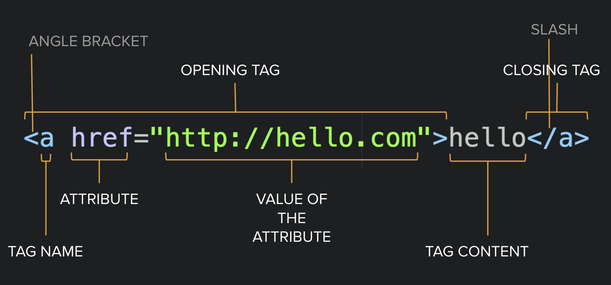
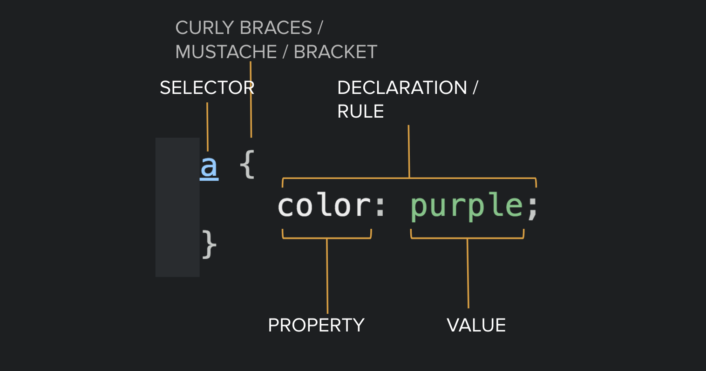

# HTML & CSS: Intro

## Tools for the course

- teaching materials - this!
- communication - on Slack

## Tools for today

- [Scrimba](https://scrimba.com/)
- [MDN](https://developer.mozilla.org/en-US/docs/Web)

### Today's exercise

Join me in building an article!   
[Connect to my Scrimba]()

#### Task:
[The text you can find here](./assets/feynman.txt)
should look like
[The image you can find here](./assets/feynman.png).

## New concepts for today

- [HTML](https://developer.mozilla.org/en-US/docs/Web/HTML)
- [CSS](https://developer.mozilla.org/en-US/docs/Web/CSS)
- tag, tag name, attribute in HTML
- rule, selector, block, property, value in CSS
- using online documentation

### An HTML tag



this is good:
```HTML
<p>hello <strong>world!</strong></p>
```
this is not:
```HTML
<p>hello <strong>world!</p></strong>
```

### CSS rules



### extra tasks

- center the article on the page!
- find an image of Feynman and include it in the article!
- make it responsive!
- find the original article and compare your solutions!

***

### Preparing for the next class

- install [VSCode](https://code.visualstudio.com/)
- register to [GitHub](https://github.com/)
- install [GitHub desktop](https://desktop.github.com/)
- install [hyper](https://hyper.is/)
- install [Chrome Browser](https://www.google.com/chrome/)
