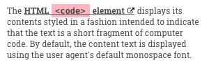

# Layout

## New concepts for today

- box model
- sizing
- positioning
- flexbox
- grid

## Today's exercise

Zeplin project link for exercises: https://app.zeplin.io/project/5b980960f8d0cb9de317da5f

### Box Model

Your CSS properties and values for this exercise:

- `display: inline` and `display: block`
- `width, height, margin, padding, border`
- `overflow`
- `display: inline-block`

Your Zeplin designs for this exercise: [4. Box Model](https://app.zeplin.io/project/5b980960f8d0cb9de317da5f?seid=5bbce097326ac118dbc7ad9e_)
and [5. Inline-Block](https://app.zeplin.io/project/5b980960f8d0cb9de317da5f?seid=5bbce08c6bc6d61900c40f1c)

|   |   |   |   |
| - | - | - | - |
|  |  |  |  |
|  |  | | |

### Positioning

your CSS properties and values for this exercise:

- `position: relative`, `absolute` and `fixed`

Your Zeplin designs for this exercise: [6. Absolute Positioning](https://app.zeplin.io/project/5b980960f8d0cb9de317da5f?seid=5bbce10feb1a041924ce9016)
and [7. Fixed Positioning](https://app.zeplin.io/project/5b980960f8d0cb9de317da5f?seid=5bbce16090d58d09c801e954)

|   |   |   |   |
| - | - | - | - |
|  |   |  | 

### Flexbox

- Use [this CSS Trick Guide on Flexbox](https://css-tricks.com/snippets/css/a-guide-to-flexbox/) for looking up the right properties!
- Start with playing with syntax at https://flexboxfroggy.com/

Your Zeplin designs for this exercise: [8. Flexbox](https://app.zeplin.io/project/5b980960f8d0cb9de317da5f?seid=5bbce1886f1d9c18e77fe740)

|   |   |   |   |
| - | - | - | - |
|  |  |  |  |
### CSS Grid

- Use [this CSS Trick Guide on Grid](https://css-tricks.com/snippets/css/complete-guide-grid/) for looking up the right properties!
- Start with playing with syntax at http://cssgridgarden.com/

Your Zeplin designs for this exercise: [9. Grid](https://app.zeplin.io/project/5b980960f8d0cb9de317da5f?seid=5bbdc3246bc6d61900cbf325)

|   |   |
| - | - |
|  |  |

### Project work

- apply text styles, create classes for them
- start laying out sections - give them width and height
- lay out the navigation using flexbox
- create the "Our Work" boxes using basic box model
- create the "Meet your new UX team" boxes using grid
- create the "We wrote a book" section using grid

## Optional homework

- Continue the game at https://flexboxfroggy.com/, http://cssgridgarden.com/ and http://www.flexboxdefense.com/
- Read more and bookmark https://css-tricks.com/snippets/css/a-guide-to-flexbox/ and https://css-tricks.com/snippets/css/complete-guide-grid/
- Check the examples at https://gridbyexample.com/examples/
