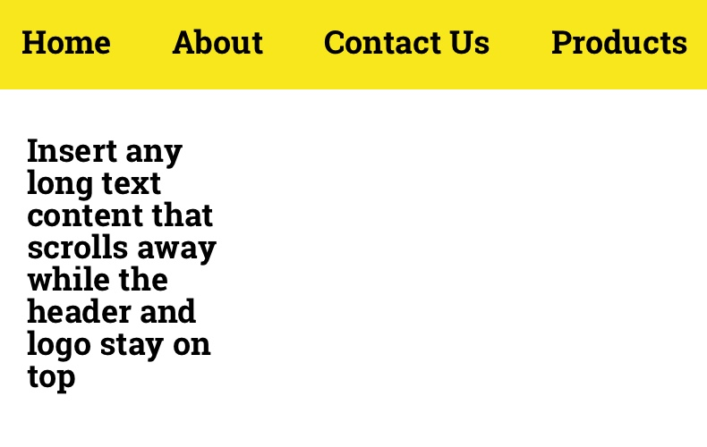
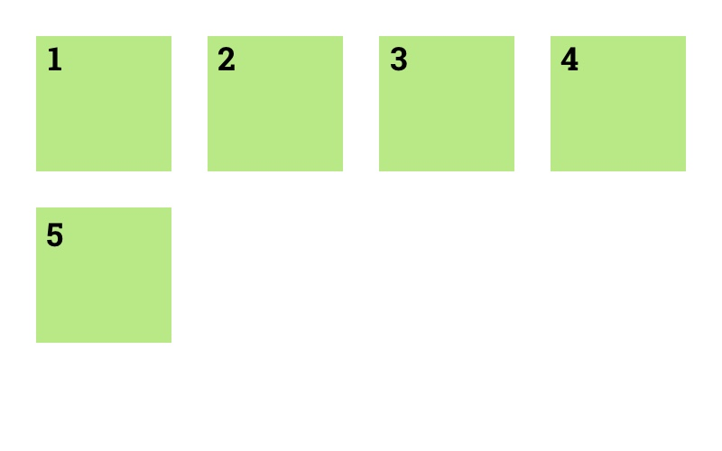
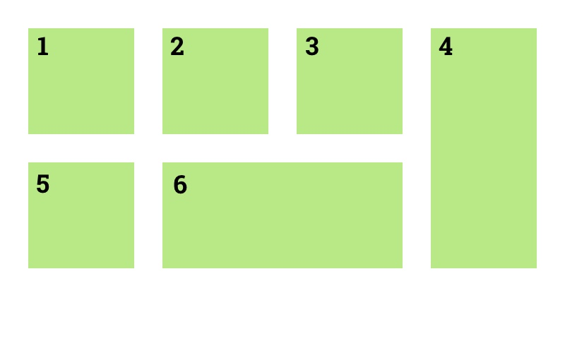

# Advanced Layouts

## New concepts for today

- flexbox
- grid

## Today's exercise

Zeplin project link for exercises: https://app.zeplin.io/project/5b980960f8d0cb9de317da5f

### Flexbox

- Use [this CSS Trick Guide on Flexbox](https://css-tricks.com/snippets/css/a-guide-to-flexbox/) for looking up the right properties!

Your Zeplin designs for this exercise: [8. Flexbox](https://app.zeplin.io/project/5b980960f8d0cb9de317da5f?seid=5bbce1886f1d9c18e77fe740)

|   |   |   |   |
| - | - | - | - |
|  |  |  |  |
### CSS Grid

- Use [this CSS Trick Guide on Grid](https://css-tricks.com/snippets/css/complete-guide-grid/) for looking up the right properties!

Your Zeplin designs for this exercise: [9. Grid](https://app.zeplin.io/project/5b980960f8d0cb9de317da5f?seid=5bbdc3246bc6d61900cbf325)

|   |   |
| - | - |
|  |  |

## Optional homework

- Play with flexbox & grid at [flexboxfroggy.com](https://flexboxfroggy.com/), [cssgridgarden.com](http://cssgridgarden.com/) and [flexboxdefense.com](http://www.flexboxdefense.com/)
- Watch [WebDev Simplified's Flexbox tutorial](https://www.youtube.com/watch?v=fYq5PXgSsbE)
- Watch [WebDev Simplified's Grid tutorial](https://www.youtube.com/watch?v=9zBsdzdE4sM)
- Watch [Jen Simmons explain CSS Grid](https://www.youtube.com/watch?v=FEnRpy9Xfes)
- Watch [Jen Simmons explain the difference between Flexbox & Grid](https://www.youtube.com/watch?v=hs3piaN4b5I)
- Watch [Rachel Andrew's explanation of Flexbox & CSS Grid](https://www.youtube.com/watch?v=hj355PRbwSQ)
- Watch [NPJ try CSS Grid for the first time](https://www.youtube.com/watch?v=3Ne9-9n5Oq0)
- Read more and bookmark [the CSS-Tricks flexbox guide](https://css-tricks.com/snippets/css/a-guide-to-flexbox/) and [the CSS-Tricks grid guide](https://css-tricks.com/snippets/css/complete-guide-grid/)
- Check the examples at [Grid By Example](https://gridbyexample.com/examples/)
